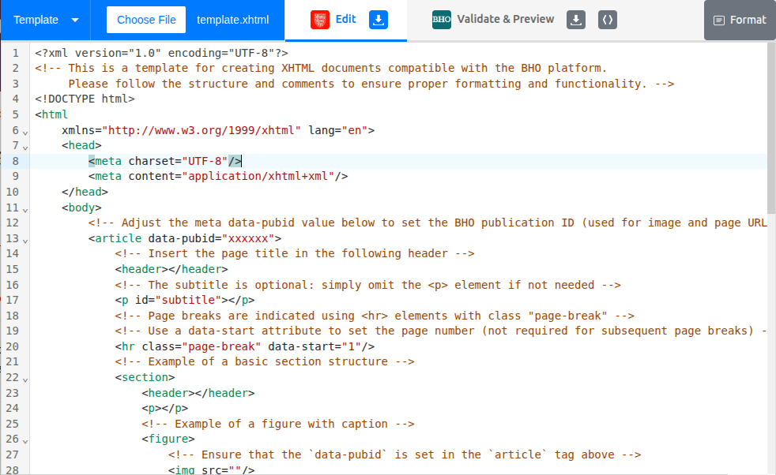
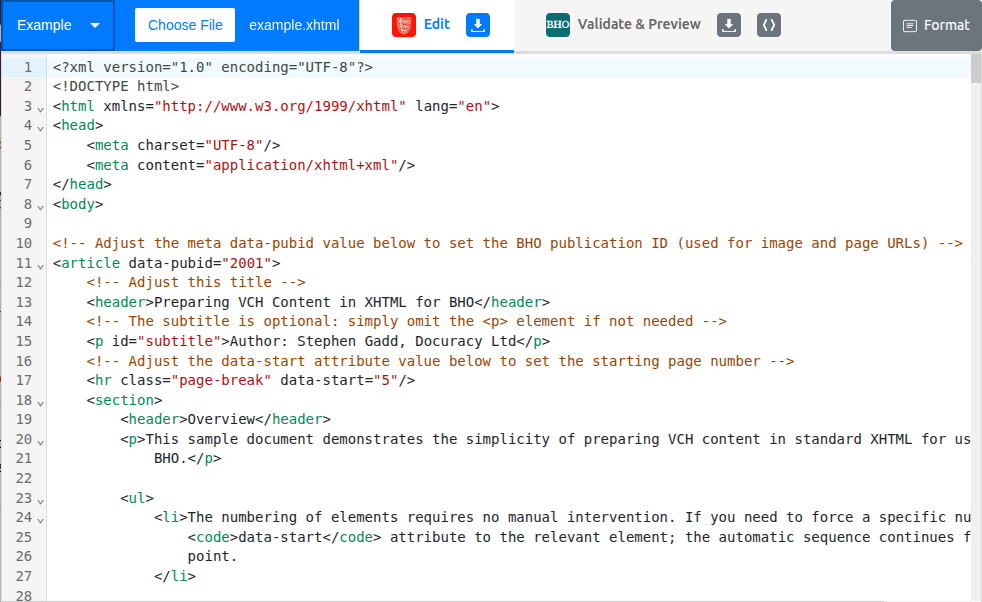
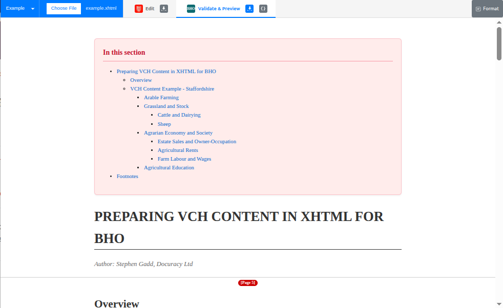
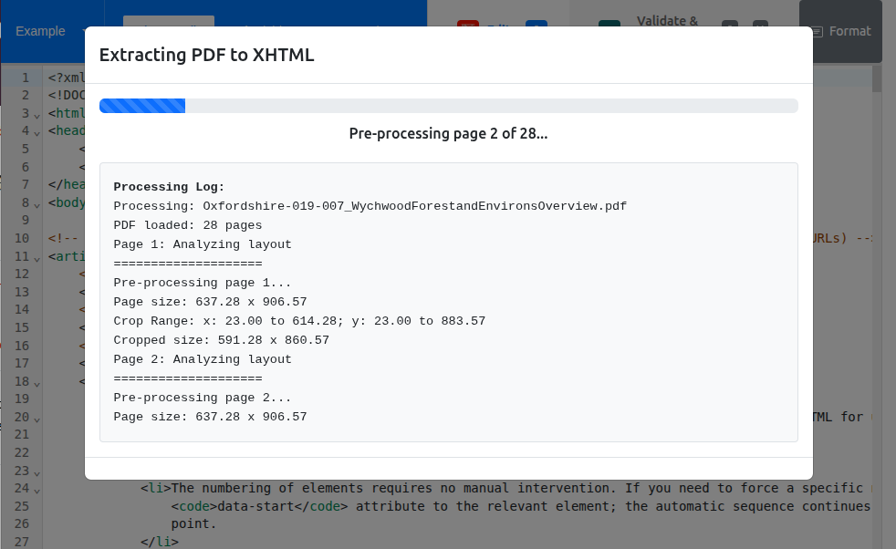

  
  

# VCH Publisher for BHO

## Overview

This is a **browser-hosted software application** designed to
convert [Victoria County History](https://www.history.ac.uk/research/victoria-county-history) (VCH) PDF files into a
simple XHTML format. The
software provides an editing window for making manual corrections or adjustments, and then validates and converts the
XHTML into HTML suitable for display on the [British History Online](https://www.british-history.ac.uk/) (BHO) platform.
The application provides a preview of this HTML, which can also be converted into BHO's legacy XML format.

> ⚙️ How it Works
>
> Think of this tool not as a standard website, but as **software that runs inside your browser**.
>
> When you open the link, your browser "installs" the application code into its temporary memory. From that moment on,
> the
> software runs entirely on your own computer. The browser simply provides the window and user interface for you to
> interact with the software.
>
> This approach offers the best of both worlds:
>
> 1. **Like Installed Software:** It works offline, uses your computer's processing power (not a remote server), and
     keeps
     your documents private on your hard drive.
> 2. **Like a Website:** You do not need to run complex installers, manage updates, or worry about compatibility. You
     always have the latest version instantly.

**It can be loaded by visiting GitHub Pages [HERE](https://docuracy.github.io/VCH-PDF2BHO/).**

On first-opening, the application opens this basic XHTML template, which is annotated with basic instructions:

Users can alternatively switch to an example file using the switcher in the top-left corner:

These files can also be inspected in the GitHub repository:

- [Template](https://raw.githubusercontent.com/docuracy/VCH-PDF2BHO/refs/heads/master/xhtml-view/template.xhtml)
- [Example](https://raw.githubusercontent.com/docuracy/VCH-PDF2BHO/refs/heads/master/xhtml-view/example.xhtml)

> 💡 The application automatically saves the user's work in the browser's LocalStorage, and this will be reloaded on
> returning to the page, overriding display of the default or example file.

The rendering of the XHTML can be tested by switching to the "Validate & Preview" tab:

Files can be saved to the user's machine as XHTML, HTML, or BHO-XML using the buttons in the respective tabs.

## PDF Conversion

The core rationale for development of this application was to automate the preparation of legacy VCH PDFs for digital
publishing. This is done by using the "Choose File" button to select a PDF from the user's local file system. This
button can also be used to load previously-saved XHTML files.

When conversion is complete, the resulting XHTML is loaded into the editing window. The "Format" button (top-right) will
arrange the XHTML into a readily-legible, structured format. **The XHTML will always require some manual correction**
due to
the challenges described [below](#technical-challenges).

### Editing

> ⚠️ **IMPORTANT:** Although the application attempts to autosave the user's work in the browser's LocalStorage, this is
> not
> a substitute for regular manual saving of work to the user's local file system. LocalStorage can be cleared by the
> user or the
> browser at any time, and there are limits on how much data can be stored. Additionally, LocalStorage is specific to
> the
> browser and device being used, so work saved in one environment will not be accessible from another.
>
> **Users must save their work regularly!**

The editor has been configured with a number of potentially-useful features:

- Save current work:
    - **Ctrl+S** (or use the "Save XHTML" button)
- Toggle formatting of selected text:
    - **Ctrl+B**: Bold
    - **Ctrl+I**: Italic
    - **Ctrl+U**: Underline
- Indentation of current line:
    - **Tab**: Indent
    - **Shift+Tab**: Outdent
- Undo/Redo:
    - **Ctrl+Z**: Undo
    - **Ctrl+Y**: Redo
- Search (and optionally Replace):
    - **Ctrl+F**
- Reformat XHTML:
    - ⚠️ _CAUTION: The following keystroke would normally trigger the browser's "Reload Page" function, which might
      result in
      loss of unsaved work. Be absolutely sure that the editor window has focus before using this shortcut, or use the
      button instead._
    - **Ctrl+R** (or use the "Format" button)

### Technical Challenges

Extraction of text from PDFs is not nearly as straightforward as might be hoped, and none of the pre-existing
PDF-to-text tools comes anywhere close to handling the complexities of VCH PDFs.

The following are some of the main challenges:

- The PDF viewport is not aligned with the crop box, which needs to be detected in the PDF commands.
- Text blocks in the PDF commands are rarely in the correct reading order, and can include hidden (white-rendered) text.
- Rows and columns need to be detected dynamically in rendered images of each page, and running headers and footnote
  blocks identified.
- Paragraphs may be split across multiple text blocks, requiring reassembly.
- End-of-line hyphenation is not easily rectified reliably.
- Fonts and their rendered sizes are not explicitly declared as heading, body, or footnote text.
- Page-based footnotes have to be converted to endnotes with sequential numbering across the entire document.
- Certain types of chart and map are rendered as vectors, which need to be identified, masked from text extraction, and
  converted to images.
- Tables are inconsistently formatted *and so will usually require manual correction*. Coding of an effective table
  parser is feasible but not financially viable.
- Large PDFs require careful management of available browser memory.
- PDFs produced at different times and with differing software have inconsistent formatting.

## XHTML - HTML - BHO XML Transformation

The application uses [Saxon-JS](https://www.saxonica.com/saxon-js/index.xml) to perform XSLT 3.0 transformations of the
XHTML into HTML for previewing, and into BHO's legacy XML format for saving. The formats are discussed in a separate
document [here](https://github.com/docuracy/VCH-PDF2BHO/blob/master/SCHEMAS.md).

## Technologies Used

- **JavaScript**: Core language for the application logic.
- **HTML/CSS**: Markup and styling for the user interface.
- **OpenCV.js**: Library for image processing.
- **XSLT**: Transformation language for converting XHTML to BHO formats.
- **GitHub Pages**: Hosting platform for the application.
- **GitHub Actions**: Continuous deployment workflow for the application.
- **Bootstrap**: Framework for responsive design and UI components.
- **PDF.js**: Library for parsing and rendering PDF files.
- **JSZip**: Library for handling ZIP files.
- **FileSaver.js**: Library for saving files on the client-side.
- **Simple Statistics**: Library for statistical calculations.
- **LZ-String**: Library for string compression.
- **LocalStorage**: Browser storage for saving page data, optimising memory usage.
- **Saxon-JS**: High-performance XSLT 3.0 processor used for generating previews and BHO XML.
- **Web Workers**: Background threads for OpenCV operations.
- **CodeMirror**: In-browser code editor for XHTML editing with syntax highlighting and line numbering.

## Deployment

The project uses GitHub Actions for continuous deployment to GitHub Pages. The `build.yml` workflow handles the
deployment process, including cache-busting for static assets.

## License

This project is licensed under the Creative Commons Attribution-NonCommercial 4.0 International License. See
the [LICENSE](LICENSE.md) file for more details.

**Copyright © Docuracy Ltd & Stephen Gadd.**

If you use or adapt this software in your research or project, please cite it as:
> Gadd, S. (2025). *VCH Publisher for BHO*. Docuracy
> Ltd. [https://github.com/docuracy/VCH-PDF2BHO](https://github.com/docuracy/VCH-PDF2BHO)