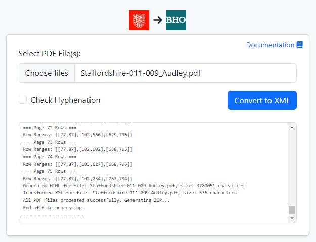
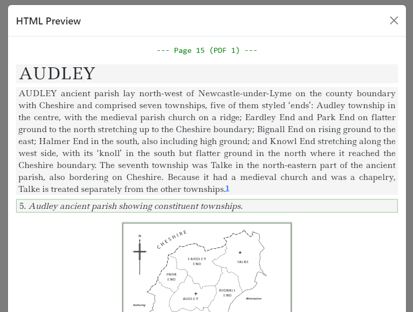

# Victoria County History PDF to British History Online XML Converter

## Overview

This browser-based application
converts [Victoria County History](https://www.history.ac.uk/research/victoria-county-history) (VCH) PDF files to
HTML, ready for further conversion to
the [British History Online](https://www.british-history.ac.uk/catalogue/source_type/Secondary%20texts) (BHO) custom XML
format. It provides a user-friendly interface for selecting PDF files, configuring options, and
viewing the conversion results.

**It is running on GitHub Pages [HERE](https://docuracy.github.io/VCH-PDF2BHO/).**

*NOTE: The final conversion from HTML to BHO-XML format is currently disabled.*

## Challenges

Conversion of PDFs to HTML (and XML) is not nearly as straightforward as it might seem. The following are some of the
main challenges:

- The PDF viewport is not aligned with the crop box, which needs to be detected in the PDF commands.
- Text blocks in the PDF commands are rarely in the correct reading order, and can include hidden (white-rendered) text.
- Rows and columns need to be detected dynamically in rendered images of each page, and running headers and footnote
  blocks identified.
- Paragraphs may be split across multiple text blocks, requiring reassembly.
- End-of-line hyphenation is not easily rectified.
- Fonts and their rendered sizes are not explicitly declared as heading, body, or footnote text.
- Page-based footnotes have to be converted to endnotes with sequential numbering across the entire document.
- Certain types of chart and map are rendered as vectors, which need to be identified, masked from text extraction, and
  converted to images.
- Tables are inconsistently formatted *and so will usually require manual correction*. Coding of an effective table
  parser is feasible but not financially viable.
- Large PDFs require careful management of available browser memory.
- PDFs produced at different times and with differing software have inconsistent formatting. *NOTE: This means that the
  software needs to be "tuned" for each distinct set of PDFs. It is currently tuned for Staffordshire 2012.*

## Features

- **PDF to XML Conversion**: Convert PDF files to BHO-XML format.
- **Batch Processing**: Select and process multiple PDF files at once.
- **Hyphenation Check**: Option to check and correct hyphenation in words broken at the ends of lines.
- **HTML Preview**: View the converted XML content in an HTML preview modal.
- **Cache Busting**: Automatically update CSS and JS links with a cache-busting timestamp.

## Technologies Used

- **JavaScript**: Core language for the application logic.
- **HTML/CSS**: Markup and styling for the user interface.
- **OpenCV.js**: Library for image processing.
- **Web Workers**: Background threads for OpenCV operations and fetching hyphenation data from
  the [Datamuse API](https://www.datamuse.com/api/).
- **XSLT**: Transformation language for converting HTML to BHO-XML format.
- **GitHub Pages**: Hosting platform for the application.
- **GitHub Actions**: Continuous deployment workflow for the application.
- **Bootstrap**: Framework for responsive design and UI components.
- **jQuery**: Simplified DOM manipulation and event handling.
- **PDF.js**: Library for parsing and rendering PDF files.
- **JSZip**: Library for handling ZIP files.
- **FileSaver.js**: Library for saving files on the client-side.
- **Simple Statistics**: Library for statistical calculations.
- **LZ-String**: Library for string compression.
- **LocalStorage**: Browser storage for saving page data, optimising memory usage.

## Project Structure

- `index.html`: Main HTML file for the application interface.
- `css/styles.css`: Custom styles for the application.
- `js/app.js`: Main JavaScript file for application logic.
- `js/utilities.js`: Utility functions used across the application.
- `js/imaging.js`: Functions related to image processing.
- `js/text.js`: Functions related to text processing.
- `js/pdf.js`: Functions related to PDF processing.
- `scripts/anti-cache.js`: Script for adding cache-busting timestamps to CSS and JS links.
- `build.yml`: GitHub Actions workflow for deploying the application to GitHub Pages.

## Usage

1. **Select PDF Files**: Use the file input to select one or more PDF files.
2. **Configure Options**: Check the "Check Hyphenation" option if needed.
3. **Convert to XML**: Click the "Convert to XML" button to start the conversion process.
4. **View Results**: The converted XML content will be displayed in the HTML preview modal.

## Deployment

The project uses GitHub Actions for continuous deployment to GitHub Pages. The `build.yml` workflow handles the
deployment process, including cache busting for static assets.

## License

This project is licensed under the Creative Commons Attribution-NonCommercial 4.0 International License. See
the [LICENSE](LICENSE.md) file for more details.